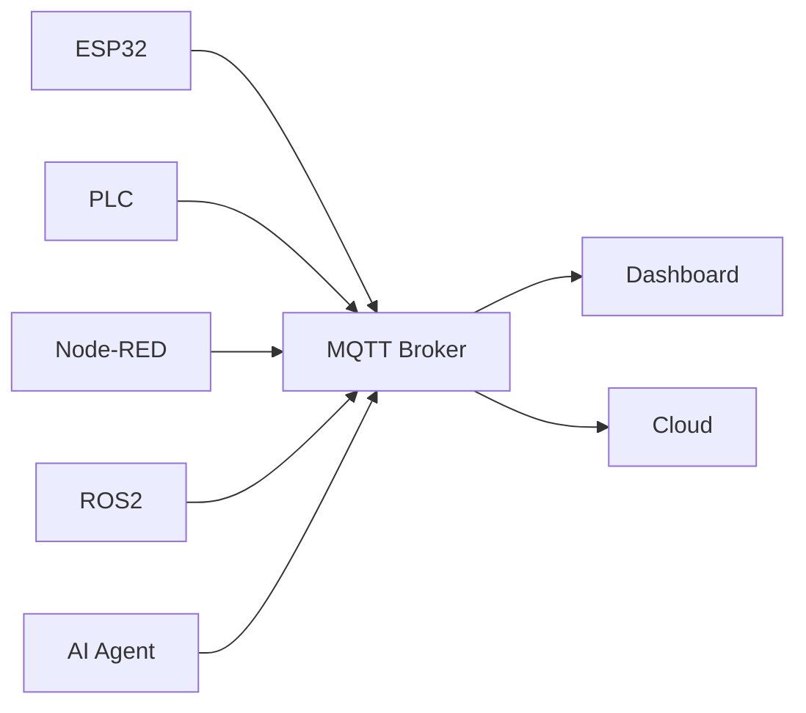

# MQTT Broker with Podman Compose on WSL Ubuntu


YouTube Video : https://youtube.com/@kopesolution?si=yYR2q-bErQooiyFt

ติดตั้ง Eclipse Mosquitto MQTT Broker บน WSL Ubuntu ด้วย Podman Compose สำหรับงาน IoT, IIoT, AIoT, PLC, Node-RED และ ROS2

เหมาะสำหรับ:
- IoT Engineer
- IIoT Engineer
- AIoT Developer
- PLC Engineer
- Node-RED Developer
- ROS2 Developer
- Homelab
- Smart Factory
- Industrial Automation

---

# Environment

- Windows 10/11
- WSL2
- Ubuntu 24.04 LTS
- Podman
- Podman Compose
- Eclipse Mosquitto

---

# What is MQTT?

MQTT คือ Lightweight Messaging Protocol สำหรับการสื่อสารระหว่างอุปกรณ์ในระบบ IoT และ IIoT

ใช้สำหรับ:
- ESP32
- PLC
- Node-RED
- ROS2
- Dashboard
- SCADA
- AI Agent
- Cloud Systems

---

# MQTT Architecture



---

# Install Podman

อัปเดตแพ็กเกจ:

```bash
sudo apt update && sudo apt upgrade -y
```

<br>

ติดตั้ง Podman:

```bash
sudo apt install -y podman
```

<br>

ตรวจสอบเวอร์ชัน:

```bash
podman --version
```

---

# Install Podman Compose

ติดตั้ง:

```bash
sudo apt install -y podman-compose
```

<br>

ตรวจสอบ:

```bash
podman-compose version
```

---

# Remove Old MQTT Lab (Optional)

หยุดและลบ Container เดิม:

```bash
podman stop mosquitto
podman rm mosquitto
```

<br>

ลบ Project เดิม:

```bash
rm -rf ~/iiot-labs/mosquitto
```

---

# 📁 Create Project Directory

สร้างโฟลเดอร์โปรเจกต์:

```bash
mkdir -p ~/iiot-labs/mosquitto/config
mkdir -p ~/iiot-labs/mosquitto/data
mkdir -p ~/iiot-labs/mosquitto/log

cd ~/iiot-labs/mosquitto
```

---

# 📄 Create mosquitto.conf

สร้างไฟล์:

```bash
nano ~/iiot-labs/mosquitto/config/mosquitto.conf
```

<br>

วางเนื้อหาดังนี้:

```conf
listener 1883 0.0.0.0

allow_anonymous false

password_file /mosquitto/config/passwordfile

persistence true
persistence_location /mosquitto/data/

log_dest file /mosquitto/log/mosquitto.log
```

---

# 🔐 Create MQTT Username and Password

รันคำสั่ง:

```bash
podman run --rm -it \
-v ./config:/mosquitto/config \
docker.io/eclipse-mosquitto:2 \
mosquitto_passwd -c /mosquitto/config/passwordfile kope
```

<br>

ตั้งรหัสผ่านตามต้องการ

---

# 🔒 Set Permissions

```bash
chmod 777 ./config/passwordfile
chmod -R 777 ./config ./data ./log
```

---

# 📄 Create compose.yml

สร้างไฟล์:

```bash
nano ~/iiot-labs/mosquitto/compose.yml
```

<br>

วางเนื้อหาดังนี้:

```yaml
services:

  mosquitto:
    image: docker.io/eclipse-mosquitto:2

    container_name: mosquitto

    restart: unless-stopped

    ports:
      - "1883:1883"

    volumes:
      - ./config:/mosquitto/config
      - ./data:/mosquitto/data
      - ./log:/mosquitto/log
```

---

# Start MQTT Broker

รัน Container:

```bash
cd ~/iiot-labs/mosquitto

podman-compose up -d
```

---

# 📋 Check Running Containers

```bash
podman ps
```

<br>

Expected:

```text
STATUS: Up
PORTS: 0.0.0.0:1883->1883/tcp
```

---

# 📜 View Logs

```bash
podman logs -f mosquitto
```

<br>

Expected:

```text
Info: running mosquitto as user: mosquitto.
Restored 0 retained messages
```

---

# MQTT Subscribe Test

เปิด Terminal 1:

```bash
podman exec -it mosquitto mosquitto_sub \
-h localhost \
-u kope \
-P 'YOUR_PASSWORD' \
-t test/topic
```

---

# MQTT Publish Test

เปิด Terminal 2:

```bash
podman exec -it mosquitto mosquitto_pub \
-h localhost \
-u kope \
-P 'YOUR_PASSWORD' \
-t test/topic \
-m "Hello MQTT"
```

---

# Expected Result

Terminal Subscribe จะแสดง:

```text
Hello MQTT
```

แสดงว่า MQTT Broker ทำงานสำเร็จ 🚀

---

# Useful Commands

## Stop Container

```bash
podman stop mosquitto
```

---

## Start Existing Container

```bash
podman start mosquitto
```

---

## Restart Container

```bash
podman restart mosquitto
```

---

## Remove Container

```bash
podman stop mosquitto
podman rm mosquitto
```

---

## Remove Everything

```bash
podman stop mosquitto
podman rm mosquitto

rm -rf ~/iiot-labs/mosquitto
```

---

# 🌐 Real Industrial Use Cases

MQTT ถูกใช้งานใน:
- Smart Factory
- Industrial Automation
- SCADA
- IIoT
- AIoT
- Edge AI
- Robotics
- ROS2
- PLC Communication
- Remote Monitoring

---

# 🔥 Next Step

หลังจากติดตั้ง MQTT Broker สำเร็จ สามารถต่อยอดไปยัง:

- Node-RED MQTT
- ESP32 MQTT
- PLC MQTT
- ROS2 MQTT Bridge
- Dashboard Systems
- Industrial SCADA
- AI Agent Integration

---

# 🧠 Key Idea

```text
MQTT is the communication backbone of modern IoT and IIoT systems.
```

---

# 👨‍💻 Author

KOPE-SOLUTION

GitHub: https://github.com/KOPE-SOLUTION
Email: kittisak.hanheam@gmail.com
YouTube Channel: https://youtube.com/@kopesolution?si=yYR2q-bErQooiyFt