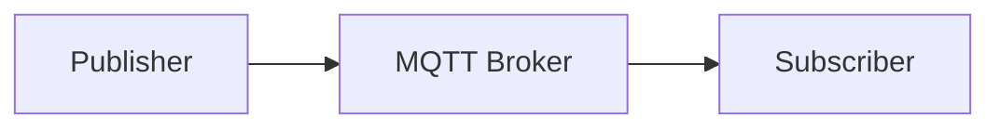
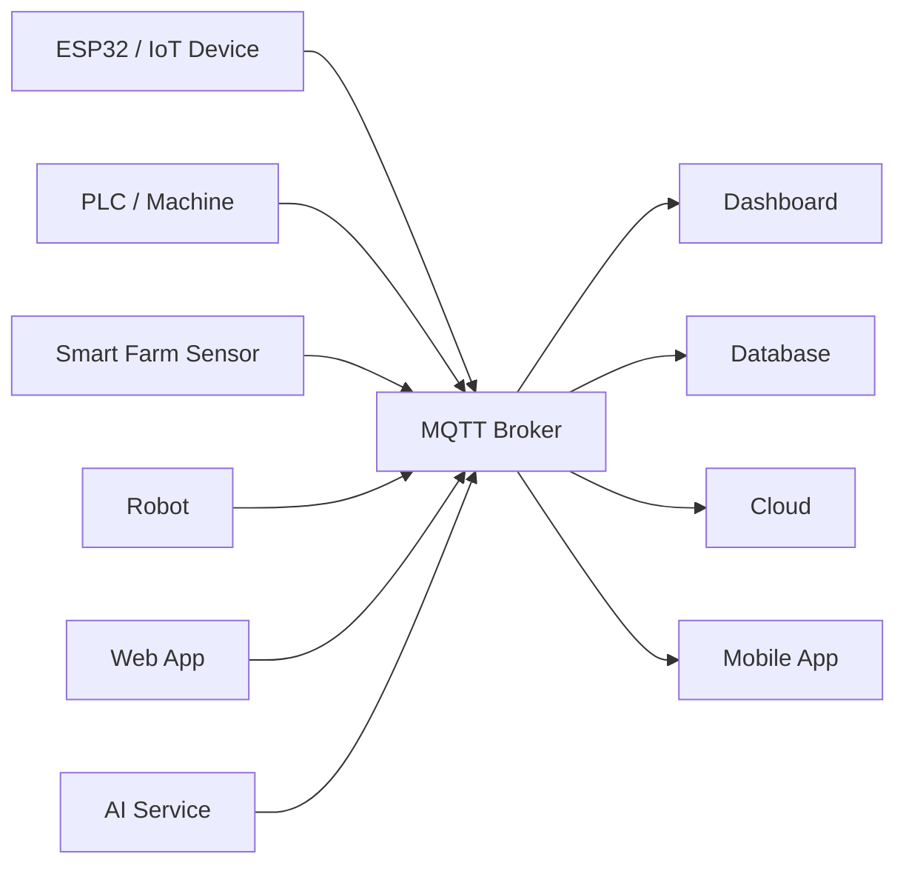

# MQTT Broker on Podman + WSL Ubuntu


YouTube Video : https://youtube.com/@kopesolution?si=yYR2q-bErQooiyFt

ติดตั้ง MQTT Broker ด้วย Eclipse Mosquitto บน WSL Ubuntu ผ่าน Podman Compose สำหรับงานสื่อสารข้อมูลแบบ Real-time

เหมาะสำหรับ:
- IoT
- Web Application
- Dashboard
- Home Automation
- Industrial Automation
- Smart Farm
- Robotics
- AI / Data Pipeline
- Edge Computing
- Monitoring System
- Homelab

---

# Environment

- Windows 10/11
- WSL2
- Ubuntu 24.04 LTS
- Podman
- Podman Compose
- Eclipse Mosquitto

---

# What is MQTT?

MQTT คือ Protocol สำหรับรับส่งข้อความแบบเบา รวดเร็ว และเหมาะกับงาน Real-time Messaging

MQTT ใช้แนวคิด:

```text
Publisher → MQTT Broker → Subscriber
```

ตัวอย่างการใช้งาน:
- Sensor ส่งข้อมูลไป Dashboard
- ESP32 ส่งข้อมูลไป Server
- Web App รับข้อมูลแบบ Real-time
- Node-RED เชื่อมต่ออุปกรณ์หลายระบบ
- Robot ส่งสถานะการทำงาน
- AI System รับข้อมูลจาก Edge Device

---

# MQTT Architecture



---

# Example Use Cases



---

# Project Directory

แนะนำให้ใช้โฟลเดอร์นี้:

```bash
~/mqtt-broker-podman-compose
```

เวลาใช้คำสั่งใน README นี้ ให้ยืนอยู่ที่โฟลเดอร์หลักของโปรเจกต์:

```bash
cd ~/mqtt-broker-podman-compose
```

โครงสร้างไฟล์:

```text
mqtt-broker-podman-compose/
├── compose.yml
├── config/
│   ├── mosquitto.conf
│   └── passwordfile
├── data/
├── log/
└── images/
    └── Thumbnail.png
```

---

# Install Podman

อัปเดตแพ็กเกจ:

```bash
sudo apt update && sudo apt upgrade -y
```

ติดตั้ง Podman:

```bash
sudo apt install -y podman
```

ตรวจสอบเวอร์ชัน:

```bash
podman --version
```

---

# Install Podman Compose

ติดตั้ง:

```bash
sudo apt install -y podman-compose
```

ตรวจสอบ:

```bash
podman-compose version
```

---

# Create Project Directory

สร้างโฟลเดอร์โปรเจกต์:

```bash
mkdir -p ~/mqtt-broker-podman-compose/config
mkdir -p ~/mqtt-broker-podman-compose/data
mkdir -p ~/mqtt-broker-podman-compose/log
mkdir -p ~/mqtt-broker-podman-compose/images
```

เข้าไปที่โฟลเดอร์หลัก:

```bash
cd ~/mqtt-broker-podman-compose
```

> สำคัญ: คำสั่งต่อจากนี้ให้รันจากโฟลเดอร์ `~/mqtt-broker-podman-compose`

---

# Create mosquitto.conf

สร้างไฟล์:

```bash
nano config/mosquitto.conf
```

วางเนื้อหาดังนี้:

```conf
listener 1883 0.0.0.0

allow_anonymous false

password_file /mosquitto/config/passwordfile

persistence true
persistence_location /mosquitto/data/

log_dest file /mosquitto/log/mosquitto.log
```

---

# Create MQTT Username and Password

ต้องรันคำสั่งนี้จากโฟลเดอร์หลัก:

```bash
cd ~/mqtt-broker-podman-compose
```

สร้าง User สำหรับ MQTT:

```bash
podman run --rm -it \
-v ./config:/mosquitto/config \
docker.io/eclipse-mosquitto:2 \
mosquitto_passwd -c /mosquitto/config/passwordfile kope
```

ระบบจะให้ตั้งรหัสผ่านของ user `kope`

---

# Set Permissions

สำหรับ Lab บน WSL Ubuntu ให้ตั้ง permission แบบง่าย:

```bash
chmod 777 ./config/passwordfile
chmod -R 777 ./config ./data ./log
```

---

# Create compose.yml

สร้างไฟล์:

```bash
nano compose.yml
```

วางเนื้อหาดังนี้:

```yaml
services:

  mosquitto:
    image: docker.io/eclipse-mosquitto:2

    container_name: mosquitto

    restart: unless-stopped

    ports:
      - "1883:1883"

    volumes:
      - ./config:/mosquitto/config
      - ./data:/mosquitto/data
      - ./log:/mosquitto/log
```

---

# Start MQTT Broker

รัน Container:

```bash
cd ~/mqtt-broker-podman-compose

podman-compose up -d
```

---

# Check Running Container

```bash
podman ps
```

Expected:

```text
STATUS: Up
PORTS: 0.0.0.0:1883->1883/tcp
```

---

# View Logs

```bash
podman logs -f mosquitto
```

Expected:

```text
Info: running mosquitto as user: mosquitto.
```

---

# MQTT Subscribe Test

เปิด Terminal 1:

```bash
podman exec -it mosquitto mosquitto_sub \
-h localhost \
-u kope \
-P 'YOUR_PASSWORD' \
-t test/topic
```

---

# MQTT Publish Test

เปิด Terminal 2:

```bash
podman exec -it mosquitto mosquitto_pub \
-h localhost \
-u kope \
-P 'YOUR_PASSWORD' \
-t test/topic \
-m "Hello MQTT"
```

---

# Expected Result

Terminal Subscribe จะแสดง:

```text
Hello MQTT
```

แสดงว่า MQTT Broker ทำงานสำเร็จ

---

# Test from WSL Host

ติดตั้ง MQTT Client บน WSL:

```bash
sudo apt install -y mosquitto-clients
```

Subscribe:

```bash
mosquitto_sub \
-h localhost \
-p 1883 \
-u kope \
-P 'YOUR_PASSWORD' \
-t test/topic
```

Publish:

```bash
mosquitto_pub \
-h localhost \
-p 1883 \
-u kope \
-P 'YOUR_PASSWORD' \
-t test/topic \
-m "Hello from WSL"
```

---

# Useful Commands

## Stop Container

```bash
podman stop mosquitto
```

---

## Start Existing Container

```bash
podman start mosquitto
```

---

## Restart Container

```bash
podman restart mosquitto
```

---

## Stop by Compose

```bash
cd ~/mqtt-broker-podman-compose

podman-compose down
```

---

## Start by Compose

```bash
cd ~/mqtt-broker-podman-compose

podman-compose up -d
```

---

## Remove Container

```bash
podman stop mosquitto
podman rm mosquitto
```

---

## Remove Everything and Start Fresh

```bash
podman stop mosquitto
podman rm mosquitto

rm -rf ~/mqtt-broker-podman-compose
```

---

# Important Notes

## Where should I run the commands?

ให้รันคำสั่งหลักจากโฟลเดอร์นี้:

```bash
cd ~/mqtt-broker-podman-compose
```

ตัวอย่าง:

```bash
podman-compose up -d
```

```bash
podman run --rm -it \
-v ./config:/mosquitto/config \
docker.io/eclipse-mosquitto:2 \
mosquitto_passwd -c /mosquitto/config/passwordfile kope
```

เพราะ `./config` หมายถึง:

```text
~/mqtt-broker-podman-compose/config
```

---

## Do not run the password command inside config folder

ถ้าเข้าไปอยู่ในโฟลเดอร์นี้:

```bash
cd ~/mqtt-broker-podman-compose/config
```

แล้วใช้:

```bash
-v ./config:/mosquitto/config
```

จะผิด เพราะ path จะกลายเป็น:

```text
~/mqtt-broker-podman-compose/config/config
```

ดังนั้นแนะนำให้กลับมาที่โฟลเดอร์หลักก่อนเสมอ:

```bash
cd ~/mqtt-broker-podman-compose
```

---

# Real-World Applications

MQTT สามารถใช้ได้หลากหลาย ไม่จำกัดเฉพาะ IIoT เช่น:

- IoT Sensor Network
- Web Dashboard
- Home Automation
- Smart Farm
- Robotics
- AI Data Pipeline
- Remote Monitoring
- Energy Monitoring
- Smart City
- Logistics Tracking
- Industrial Monitoring
- Edge Computing

---

# Next Step

หลังจากติดตั้ง MQTT Broker สำเร็จ สามารถต่อยอดไปยัง:

- Node-RED MQTT
- ESP32 MQTT
- Web Dashboard
- Database Logging
- PLC Data Monitoring
- ROS2 MQTT Bridge
- AI Agent Integration
- Cloud Monitoring

---

# Key Idea

```text
MQTT Broker is a central message hub for real-time systems.
```

ระบบต่าง ๆ สามารถ Publish และ Subscribe ข้อมูลผ่าน MQTT Broker เพื่อเชื่อมต่อกันได้ง่ายขึ้น

---

# Author

KOPE-SOLUTION

GitHub: https://github.com/KOPE-SOLUTION
Email: kittisak.hanheam@gmail.com
YouTube Channel: https://youtube.com/@kopesolution?si=yYR2q-bErQooiyFt
